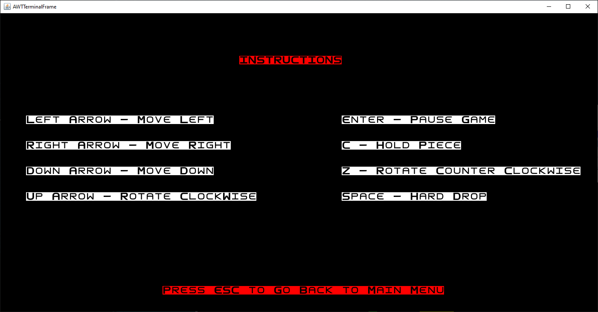
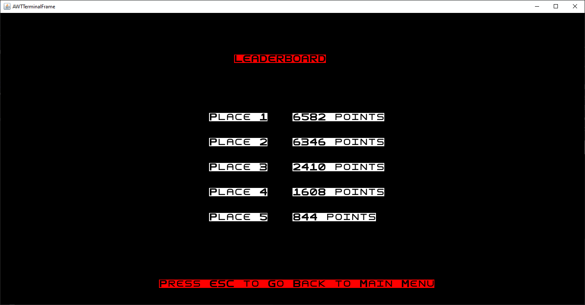
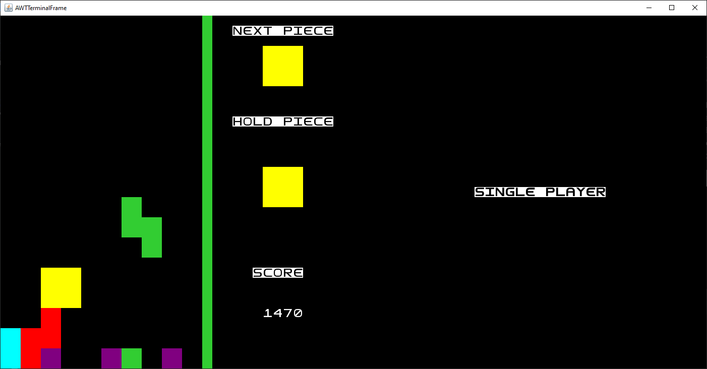
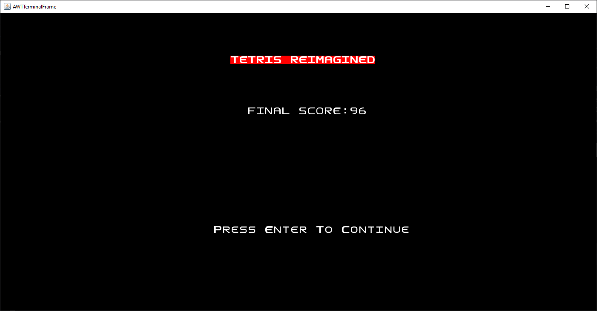
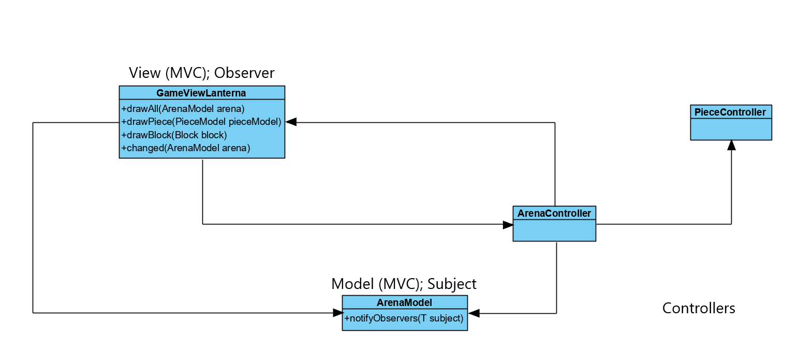
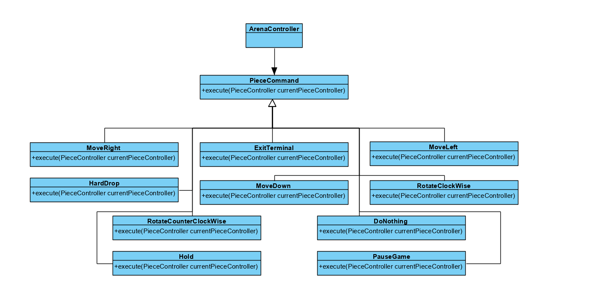
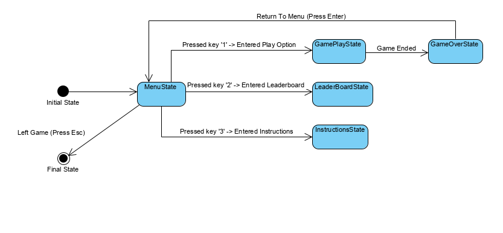
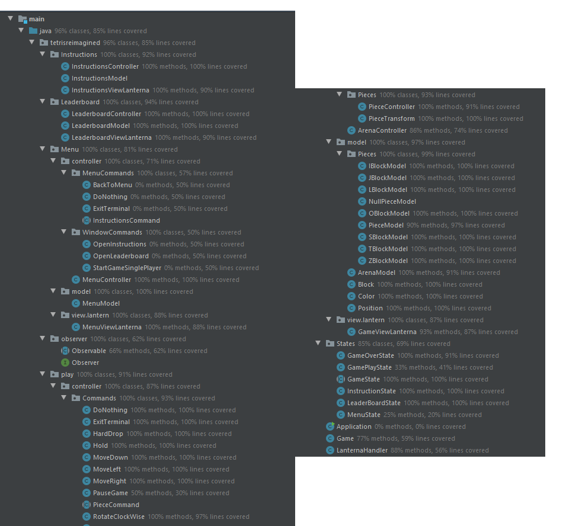

# LPOO_22 - Tetris Reimagined
Réplica do jogo Tetris, que é um jogo que consiste em empilhar blocos que descem no ecrã, de forma a completarem linhas horizontais.

Este projeto foi desenvolvido por Rui Pinto (up201806441@fe.up.pt) e Tiago Gomes (up201806658@fe.up.pt) para a unidade corricular de LPOO 2019/2020.

## Implemented Features

  
  
  
  
  
  
  
  
    

  * Movimento das peças para a esquerda e direita através do teclado.
  * Movimento das peças para baixo à medida que o tempo passa.
  * Limites das peças dentro da janela.
  * Verificação de colisões entre peças.
  * Soft drop: a peça desce mais rápido quando pressionamos a tecla 'seta para baixo'.
  * Hard drop: a peça desce na arena o máximo possível quando pressionamos a tecla SPACE.
  * Rotação das peças no sentido horário e anti-horário.
  * Remoção de linhas completas: quando uma linha está completamente preenchida por blocos, então é removida da arena (com bugs).   
  * Ajuste da posição dos blocos depois de uma linha ter sido removida: os blocos das linhas que estão acima da linha removida descem uma unidade.
  * Nível de dificuldade: aumenta a cada 6 linhas "feitas"; faz aumentar a velocidade da peça.
  * Sistema de pontuação: aumenta quando o jogador "faz uma linha", quando usa o soft ou hard drop; a pontuação adicionada é sempre multiplicada pelo nível.
  * Fim do jogo: o jogo termina quando não for possível a uma peça descer mais na arena a partir da posição inicial.
  * Peça em espera: peça que o jogador decidiu guardar para usar mais tarde.
  * Visualização da próxima peça, da peça em espera e da pontuação em modo gráfico.
  * Visualização da pontuação final e opção de voltar para o menu principal quando o jogador perde.
  * Adição de um *Menu* com as opções: jogar, ver leaderboard e ver instruções.
  * Leaderboard: visualização das top 5 pontuações.
    
     
   
   
  
  
## Planned Features
  * Modo Multiplayer

# Design
  
  * Model-View-Controller (MVC) and Observer Pattern
  
>**Problem in Context:**
> Encontrar uma estratégia que permitesse conjugar os dados (Model) com a gui (View) e com o controlador que dita as regras 
>do jogo (Controller), não implicando a renovação do código.

>**The Pattern:**
>A arquitetura MVC pressupõe a divisão do projeto e propõe a utilização da divisão do projeto em três partes diferentes,
>referidas em cima. O Model representa os dados, a View dá o display da nossa cena e envia commandos para o Controller
>e o Controller fornece os dados à View e interpreta as ações do utilizador. Decidimos incluir o Observer Pattern no MVC, 
>de modo a facilitar ainda mais a relação entre o Model e a View. Assim sendo, quando o Model é alterado, notifica a View 
>de que foram feitas alterações e redesenha a cena.

>**Implementation:**

>**Consequences:**
>Com esta implementação, alcançamos uma melhor estruturação do projeto. O processo de notificar e registo de ocorrências,
>agiliza ainda mais a questão de desenhar a cena, uma vez que a mesma só é novamente desenhada se ocorrerem alterações. 

  * Command Pattern
   
>**Problem in Context:** 
>A existência de uma cadeia de ifs na ArenaController (https://github.com/FEUP-LPOO/lpoo-2020-g22/blob/8499d7136abca20b8e0f87ea665597d1d6fe2fd1/Tetris%20Reimagined/src/main/java/tetrisreimagined/play/rules/ArenaController.java#L62-L105)
>que se tornaria cada vez maior à medida
>que aumentássemos o número de comandos a utilizar.
    
>**The Pattern:**
>O Command pattern permite parametrizar objetos com uma ação a executar. Baseia-se em diferentes funcionalidades para cada um deles.
>É comum terem um método "execute" que contém todo o código necessário à execução desse determinado comando. Dada o problema apresentado no tópico acima,
>consideramos que seria uma boa solução, uma vez que iria simplificar o código e desta forma, a ArenaController apenas executaria o comando,
>viabilizando assim o SRP (Single Responsability Principle)

>**Implementation:**

>**Consequences:** A utilização deste padrão permitiu uma maior simplificação do ArenaController ([ArenaController.java - Result](../src/main/java/tetrisreimagined/play/controller/ArenaController.java)) bem como uma maior abstração dos comandos utilizados.

  * State Pattern
 
>**Problem in Context:**
>Realizar a transição entre os vários estados possíveis do ecrã (Menu Principal, *Instructions*, *Leaderboard*, *SinglePlayer* e *Game Over*).

>**The Pattern:**
>O *State Pattern* permite que um determinado objeto realize ações dependendo do seu estado atual e da ação do utilizador (consoante um evento seja desencadeado)
>Deste modo, os vários "ecrãs" são representados por estados, sendo que cada estado altera a parte gráfica consoante a forma como ocorreu.

>**Implementation:**
>

>**Consequences:** A utilização deste padrão permitiu uma maior simplificação da classe *Game* ([Game.java - Result](../src/main/java/tetrisreimagined/Game.java)), bem como uma maior abstração dos vários estados e da passagem entre eles.
>Foi utilizado para as transições entre o Menu, *SinglePlayer*, *Leaderboard*, *Instructions Menu* e *Game Over*
  
> De modo a ilustrar as diferentes transições entre os possíveis estados, elaboramos uma *State Machine* que exemplifica as mesmas:
>
>
# Code Smells e Sugestões de Refactoring
  * **Long Method e Duplicate Code:** 
>   Os métodos rotatePiece de [RotateClockWise](../src/main/java/tetrisreimagined/play/controller/Commands/RotateClockWise.java) e [RotateCounterClockWise](../src/main/java/tetrisreimagined/play/controller/Commands/RotateCounterClockWise.java)  são bastante longos, pelo que os poderíamos ter dividido em vários métodos mais pequenos. Além disso, existe uma certa similaridade entre os métodos, havendo algum código repetido. Poderíamos condensar os comandos RotateClockWise e RotateCounterClockWise, ficando com um comando Rotate, que receberia no construtor qual o tipo de rotação.
  * **If Statements:** 
>  Os if's de getCommand, na classe [GameViewLanterna](../src/main/java/tetrisreimagined/play/view/lantern/GameViewLanterna.java), poderiam ser substituídos por um switch statement.
  
  * **Return null:** 
>  No método getBlockById, na classe [PieceController](../src/main/java/tetrisreimagined/play/controller/Pieces/PieceController.java), poderíamos criar uma classe NullBlock.

* **Switch Statements** 
> No método updateScore() da classe [ArenaController](../src/main/java/tetrisreimagined/play/controller/ArenaController.java) a existência de um switch conduz a um novo smell. A existência de este tipo estrutura condicional é sempre algo de que sempre devemos desconfiar. Provavelmente posteriormente procederemos a um refactor da mesma.
    
  
# Testing
>Os testes implementados incidem nas classes implementadas. Temos 82% das classes testadas,
>76% nos métodos e 73% nas linhas. Vale a pena sublinhar que a maior razão pela qual estes valores
>não se encontram no 100% é porque há métodos pequenos que não vale a pena serem testadas simplesmente
>porque são demasiado simples. Relativamente aos mutantes, obvitemos uma taxa de sucesso de 50%. Matamos 156 dos 310 mutantes gerados.
>Consideramos que este resultado se deve, sobretudo à dificuldade encontrada em realizar testes eficientes às funções
>que lidam com as peças e também relacionados com o facto de haver um ou outro ficheiro com carência de testes. 
>Foram também utilizadas diversas Mocks de modo a aprimorar os mesmos.

### Coverage Report

### Mutation Report

  
# Self-evaluation
>Apesar da quarentena, este projeto foi desenvolvido com recurso a um Plug-in do IntelliJ, denominado
>Floobits. Deste modo, o trabalho de cada membro do grupo não é totalmente baseado no número de commits.
>Relativamente ao projeto em si, começamos por desenvolver as suas features e só depois iniciamos a fase de testes.   
> 
> * Rui Pinto: 50%
> * Tiago Gomes: 50%